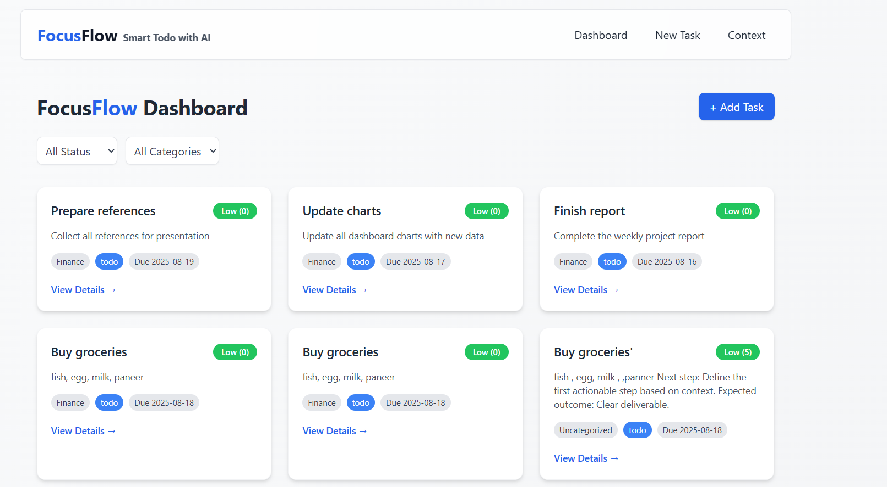
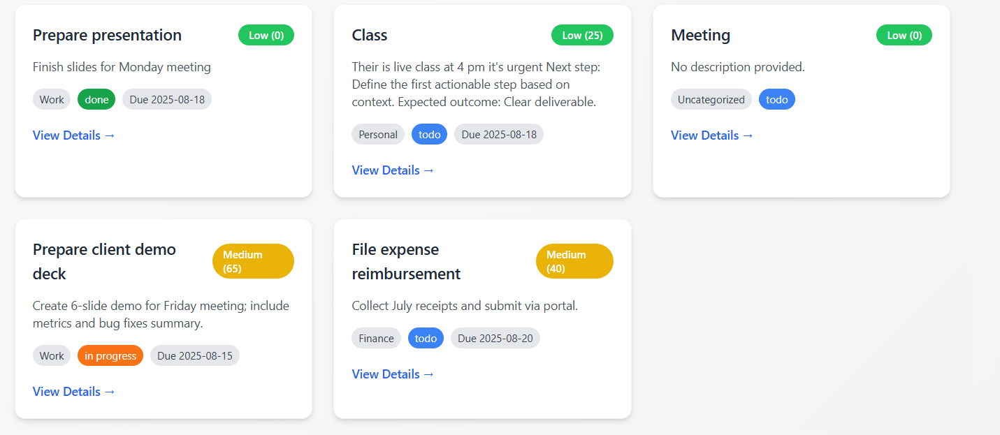
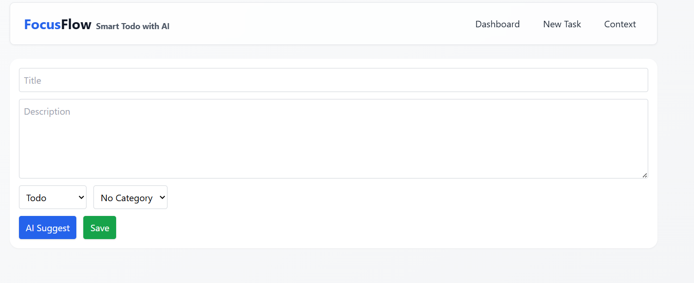
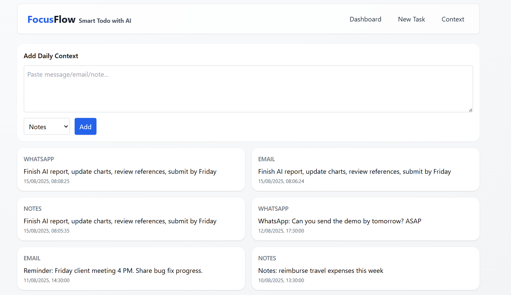
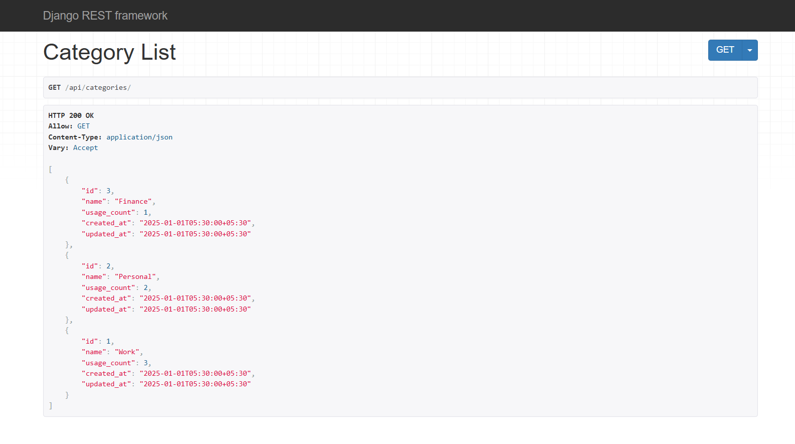
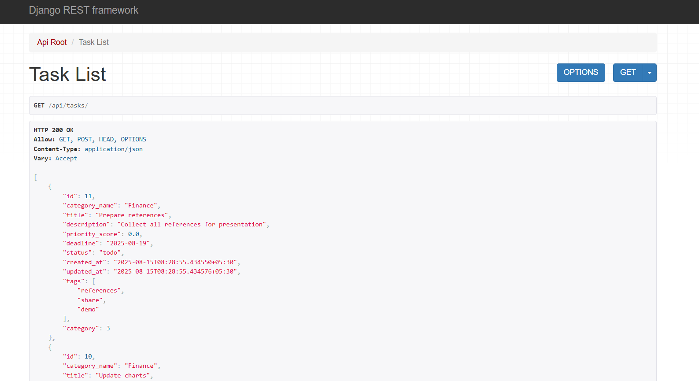
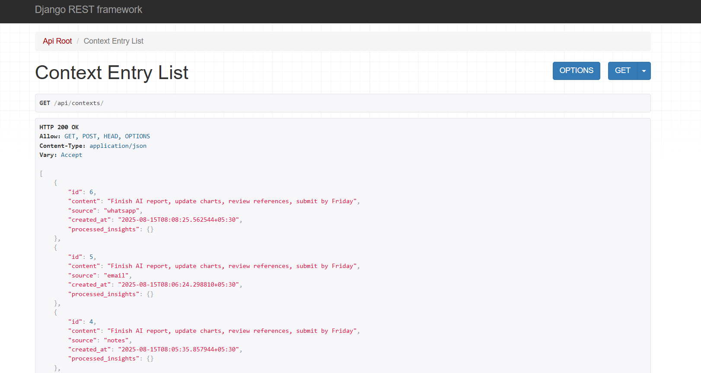

# Smart Todo List with AI


## 📌 Overview
An AI-assisted task management application built with **Django REST**, **Next.js**, and **PostgreSQL**, featuring:
- AI-based priority scoring
- Context-aware task enhancements
- Automatic deadline suggestions
- Integration with LM Studio or OpenAI

---

## 🚀 Quick Start (Without Docker)

### 1️⃣ Backend Setup
```bash
cd backend
python -m venv .venv
source .venv/bin/activate     # On Windows: .venv\Scripts\activate
pip install -r requirements.txt
cp .env.example .env
python manage.py migrate
python manage.py loaddata sample_data/categories.json
python manage.py loaddata sample_data/tasks.json
python manage.py loaddata sample_data/context_entries.json
python manage.py runserver 0.0.0.0:8000
```

### 2️⃣ Frontend Setup
```bash
cd frontend
npm install
cp .env.local.example .env.local
npm run dev
```

### 3️⃣ AI Setup
- **LM Studio**: Run local server (e.g., `http://localhost:1234/v1`) and set:
  ```env
  AI_PROVIDER=lmstudio
  ```
- **OpenAI**: Set in backend `.env`:
  ```env
  AI_PROVIDER=openai
  OPENAI_API_KEY=your_api_key
  AI_MODEL=gpt-4
  ```

---

## 🐳 Docker Setup
```bash
docker compose up -d db
docker compose run --rm backend python manage.py migrate
docker compose run --rm backend python manage.py loaddata sample_data/categories.json
docker compose run --rm backend python manage.py loaddata sample_data/tasks.json
docker compose run --rm backend python manage.py loaddata sample_data/context_entries.json
docker compose up -d backend frontend
```

---

## 📡 API Endpoints
- `GET /api/tasks/`
- `POST /api/tasks/`
- `GET /api/categories/`
- `GET /api/contexts/`
- `POST /api/contexts/`
- `POST /api/ai/suggest/`

---

## 📂 Project Structure
```
backend/
  ├── manage.py
  ├── app/
  ├── requirements.txt
  ├── sample_data/
frontend/
  ├── pages/
  ├── components/
  ├── package.json
docker-compose.yml
```

---

## 🖼 Screenshot
*(Add your screenshots here)*







---

## 👨‍💻 Developer
**Abhinav Tripathi**  
[LinkedIn](https://www.linkedin.com/in/abhinav-tripathi-770224253/) | [GitHub](https://github.com/0609Abhinav) | [Email](mailto:abhinavtripathi6sep@gmail.com)
